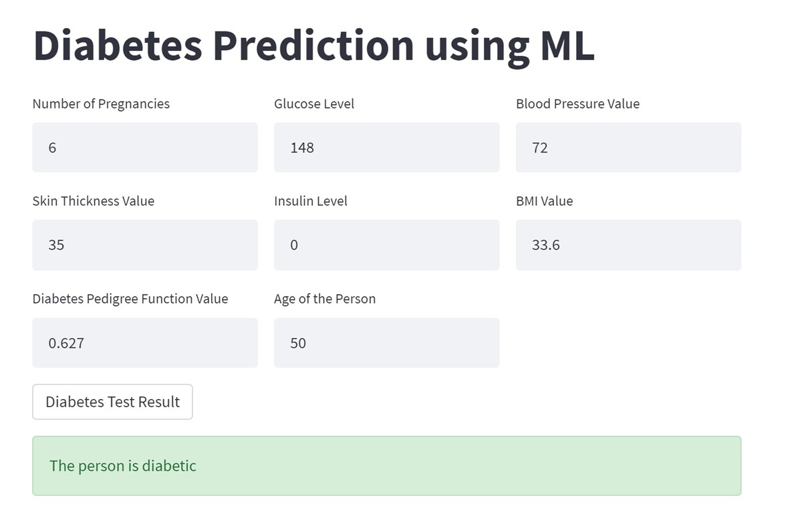
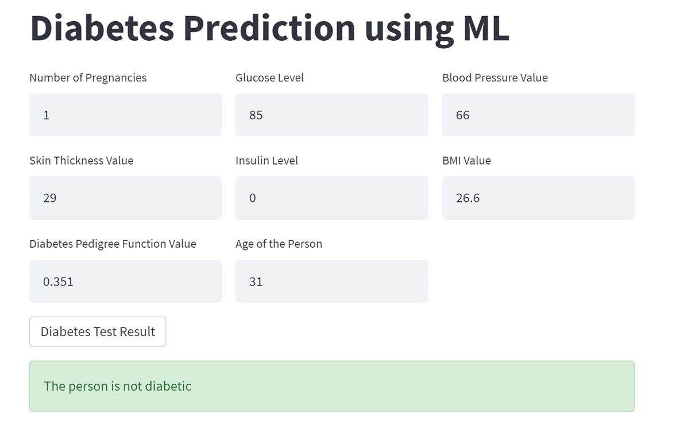

# Diabetes Prediction System 🩺

This project is a Diabetes Prediction System built using the Support Vector Machine (SVM) algorithm. It aims to predict the likelihood of a person having diabetes based on certain input features.

## Usage 🚀 

To use the Diabetes Prediction System, follow these steps:

1. Clone the repository to your local machine:

```bash
git clone https://github.com/yourusername/diabetes-prediction-system.git
```

2. Navigate to the project directory:

```bash
cd diabetes-prediction-system
```

3. Install the required dependencies. It's recommended to use a virtual environment:

```bash
pip install -r requirements.txt
```

4. Run the Streamlit web application:

```bash
streamlit run web_app.py
```

5. Once the server starts, a new browser window or tab will automatically open with the Diabetes Prediction System interface.

6. Input the required features (e.g. Glucose Level, Blood Pressure, BMI) into the provided fields.

7. Click on the "Predict" button to obtain the prediction result.

## Dataset 📊 

The dataset is provided in the diabetes.csv file where a diabetic person is classified as 1 and a non diabetic person is classified as 0.

## About SVM Algorithm 🤖 

Support Vector Machine (SVM) is a supervised machine learning algorithm that can be used for classification or regression tasks. In this project, SVM is utilized for binary classification to predict whether a person has diabetes or not based on input features.

## Test Results 📊

### Diabetic Person Prediction


### Not Spam Message Prediction

